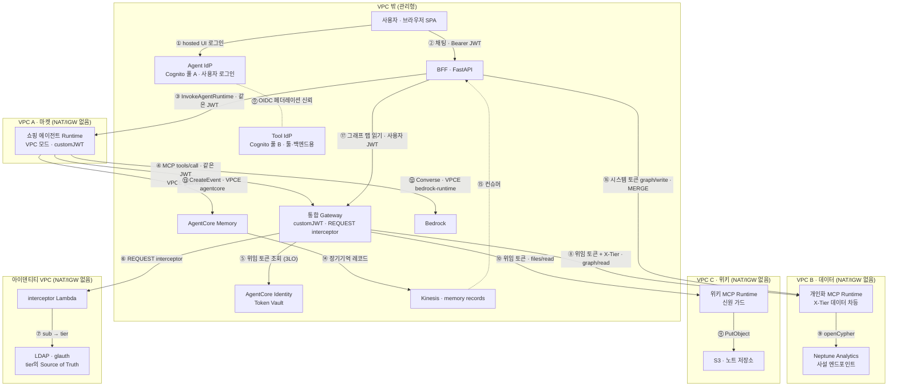

# Ontolo Market — AgentCore 초개인화 쇼핑 에이전트 데모

> **참고용 소스코드입니다.** 아키텍처와 인증 흐름을 설명하기 위한 교육용 데모이며, 프로덕션 환경에서의
> 동작·보안·성능을 보증하지 않습니다. 그대로 배포하지 말고, 자신의 환경에 맞게 검토·보강한 뒤 사용하세요.
> AWS 공식 샘플이 아닙니다.

Amazon Bedrock AgentCore(Runtime · Gateway · Identity · Memory) 위에서 동작하는 쇼핑 상담
에이전트 데모입니다. 사용자 신원(JWT)이 브라우저 → BFF → 에이전트 → 통합 Gateway까지
그대로 흐르고, Gateway 뒤의 내부 MCP 서버(개인화 그래프, 사내 위키)는 Tool IdP가 발급한
**사용자 명의의 위임 토큰**으로만 호출됩니다. 권한 등급(tier)은 토큰이 아니라 LDAP이
결정하고, Gateway의 REQUEST interceptor가 `X-Tier` 헤더로 강제 주입합니다.

이 저장소에는 **애플리케이션 코드만** 들어 있습니다. AWS 리소스 프로비저닝 스크립트,
배포 상태 파일, 아키텍처 문서는 포함하지 않습니다.

> **데모 전용 패턴 안내.** 인증 흐름을 눈으로 보여주기 위해 운영에서는 쓰지 않을 패턴을 의도적으로
> 포함합니다 — 토큰을 브라우저 localStorage에 저장, SSE에 `?token=` 쿼리 전달, 디버그 패널에
> JWT claims 표시, 무인증 데모 리셋(revoke) API. 운영에서는 HttpOnly 쿠키 기반 BFF 세션, 헤더를
> 붙일 수 있는 fetch 스트림, 관리자 API 인증으로 대체해야 합니다. `data/`의 고객·구매·건강 정보는
> 전부 합성 데이터입니다. MCP 서버(`mcp_server/`, `wiki_mcp/`)는 AgentCore Runtime/Gateway 뒤에서만
> HTTP로 동작하도록 만들어졌고, 로컬에서는 stdio로만 실행하세요.

## 구성

| 디렉토리 | 역할 | 실행 위치 |
|---|---|---|
| `frontend/` | React + Vite SPA — 쇼핑 상담, 개인화 그래프, 장기기억, 인증 흐름 디버그 패널 | 로컬 (`:5181`) |
| `backend/bff/` | FastAPI BFF — JWT 검증·고객 바인딩, 에이전트 호출(SSE), 그래프 읽기(Gateway 경유), 장기기억 파이프라인 컨슈머 | 로컬 (`:8010`) |
| `app/shopping_agent/` | Strands 기반 쇼핑 에이전트 — AgentCore Runtime(VPC 모드)에 배포 | AgentCore Runtime |
| `mcp_server/` | 개인화 그래프(Neptune Analytics) MCP 서버 — tier 데이터 차등, 읽기/쓰기 scope 분리 | AgentCore Runtime |
| `wiki_mcp/` | 사내 위키 MCP 서버 — 위임 토큰 신원으로 노트 저장 | AgentCore Runtime |
| `wiki/` | 위키 뷰어(3rd-party 시스템 대역) — Tool IdP SSO 로그인 | 로컬 (`:5182`) |
| `interceptor/` | Gateway REQUEST interceptor Lambda — LDAP 조회 → `X-Tier` 주입, revoke 목록 확인 | Lambda |
| `data/` | 데모 상품 카탈로그·고객 페르소나 | — |
| `scripts/` | 로컬 실행 스크립트 | — |

## 아키텍처 — VPC 분리 구조

마켓(에이전트), 데이터 플랫폼, 위키(사내 3rd-party 시스템 대역), 아이덴티티(LDAP)를 서로 다른 VPC에
두고, 어느 VPC에도 NAT·인터넷 게이트웨이를 만들지 않았습니다. VPC 밖으로 나가는 트래픽은 전부
VPC 엔드포인트(PrivateLink)만 통과합니다. 팀 사이의 연결은 네트워크가 아니라 **통합 Gateway 하나**로
이루어지고, 각 팀의 시스템은 그 뒤의 내부 MCP 서버로 붙습니다.



### 구역별 설명

- **VPC 밖 (관리형)**: 브라우저 SPA와 BFF(노트북, 마켓 백엔드 대역), Cognito 풀 두 개, 통합 Gateway,
  AgentCore Identity(Token Vault)·Memory, Kinesis, Bedrock. 전부 AWS 관리형 엔드포인트라 고객 VPC 안에 두지 않습니다.
- **VPC A · 마켓**: 쇼핑 에이전트 Runtime(VPC 모드). 밖으로 나가는 길은 `bedrock-runtime`·`bedrock-agentcore`·
  `bedrock-agentcore.gateway`·`logs`·`cognito-idp` 인터페이스 엔드포인트와 S3 게이트웨이 엔드포인트만입니다.
- **VPC B · 데이터**: 개인화 MCP Runtime과 Neptune Analytics. 그래프는 공개 연결을 끄고 VPC 안의 사설
  그래프 엔드포인트로만 접근합니다. 에이전트도 BFF도 Neptune에 직접 닿지 않고, 이 MCP가 유일한 데이터 접점입니다.
- **VPC C · 위키**: 위키 MCP Runtime과 노트 S3. "다른 팀의 3rd-party 시스템"을 대역하며, 위키 MCP는 Tool IdP
  토큰만 받습니다.
- **아이덴티티 VPC**: LDAP(glauth on EC2)과 Gateway REQUEST interceptor Lambda. tier(premium/basic)는 이곳에서만
  결정됩니다. Gateway에서 MCP Runtime으로 들어가는 인바운드는 AgentCore 관리형 경로라 별도 VPCE가 없습니다.

### 흐름 설명

1. **로그인(①②③)** — 사용자는 Agent IdP hosted UI로 로그인하고, 발급된 JWT가 BFF → 쇼핑 Runtime까지
   그대로 전달됩니다. 세 홉(BFF·Runtime·Gateway)은 각각 Agent IdP JWKS로 독립 검증하며 앞 홉의 판정을 믿지 않습니다.
   고객 프로필은 요청값이 아니라 JWT `sub`로 바인딩합니다.
2. **Gateway까지는 토큰 하나(④)** — 에이전트는 사용자 JWT 그대로 통합 Gateway를 호출합니다. 이 지점까지가 사용자
   토큰의 마지막 홉입니다.
3. **정책 지점(⑥⑦)** — Gateway의 REQUEST interceptor가 JWT의 `sub`로 LDAP을 조회해 `X-Tier`를 주입합니다.
   클라이언트가 보낸 값은 무조건 덮어 스푸핑을 막고, 조회 실패 시 basic으로 닫힙니다. 같은 자리에서 S3 revoke
   목록(`token.iat <= revoked_at`)을 확인해 revoke된 세션을 즉시 거부합니다.
4. **위임 토큰 교환(⑤⑧⑩)** — Gateway는 Token Vault에 저장된 Tool IdP 위임 토큰(3LO, 사용자 명의, scope
   `graph/read`·`files/read`)을 붙여 내부 MCP를 호출합니다. MCP 타깃은 사용자 JWT 패스스루를 지원하지 않으며,
   이 교환 덕분에 마켓 토큰이 백엔드까지 흘러가지 않습니다. 볼트에 토큰이 없으면 MCP URL elicitation으로
   동의 URL이 돌아오고, 사용자는 Tool IdP → Agent IdP OIDC 페더레이션(⓪ 사전 신뢰)으로 로컬 로그인 없이 동의합니다.
   Tool IdP에는 로컬 계정이 없고 사용자명이 마켓 `sub`에 JIT로 묶이므로 다른 계정 명의로 들어갈 경로가 없습니다.
5. **데이터 차등(⑧⑨)** — 개인화 MCP는 `X-Tier`로 premium은 취향 그래프 개인화, basic은 전역 인기 상품을 반환합니다.
   고객 바인딩은 위임 토큰의 신원(username)으로만 결정하고 인자를 믿지 않습니다.
6. **신원 가드(⑩⑪)** — 에이전트는 Gateway가 붙인 위임 토큰을 볼 수 없으므로, 위키 MCP의 `whoami`가 돌려준
   사용자명에 마켓 `sub`가 들어 있는지 대조한 뒤에만 노트를 씁니다.
7. **장기기억 파이프라인(⑬⑭⑮⑯)** — 대화는 AgentCore Memory에 저장되고, 추출된 장기기억 레코드가 Kinesis로
   흘러 BFF 컨슈머가 개인화 그래프에 MERGE합니다. 사용자가 없는 백그라운드 경로이므로 사용자 토큰을 재활용하지
   않고 client_credentials 시스템 토큰(`graph/write`)으로 개인화 MCP를 직접 호출합니다. 읽기 scope와 쓰기 scope는
   교차 사용이 거부됩니다.
8. **그래프 탭(⑰)** — BFF의 그래프 읽기도 에이전트와 같은 경로(Gateway → 위임 토큰 → 개인화 MCP)를 씁니다.
   미동의면 409와 동의 URL, basic은 tier 제한이 그대로 적용됩니다.

### 핵심 설계 결정

- IdP를 사람용(Agent IdP)과 툴용(Tool IdP)으로 분리. Tool IdP는 외부 3rd-party IdP의 자리를 대역한 것으로,
  실제 연동 시 그 자리에 상대 조직의 IdP가 들어옵니다.
- 인증은 앱 코드 밖의 customJWT authorizer가 담당. 잘못된 토큰은 애플리케이션에 닿기 전에 거부됩니다.
- tier의 Source of Truth는 LDAP. 재로그인 없이 tier 변경이 즉시 반영됩니다.
- MCP 서버를 VPC 모드 AgentCore Runtime에 올림. 자체 호스팅이면 Gateway가 VPC 안에 닿는 길이 퍼블릭 노출이나
  VPC Lattice뿐이고 서버·TLS 인증서를 직접 운영해야 합니다.
- Gateway MCP 세션을 켜서 타깃 MCP 세션을 재사용. VPC 모드 새 세션의 콜드스타트를 호출마다 반복하지 않습니다.

## 사전 준비

이 코드는 다음 AWS 리소스가 이미 있다고 가정합니다. 프로비저닝 스크립트는 저장소에 없습니다.

- Cognito 사용자 풀 2개(Agent IdP, Tool IdP)와 OIDC 페더레이션, 리소스 서버 scope(`files/read`, `graph/read`, `graph/write`)
- AgentCore Runtime 3개(쇼핑 에이전트, 개인화 MCP, 위키 MCP), 통합 Gateway(MCP 프로토콜, MCP 세션 활성), AgentCore Identity OAuth2 credential provider, AgentCore Memory
- Neptune Analytics 그래프(사설 엔드포인트), Kinesis 스트림(Memory records), S3 버킷(위키 노트·revoke 목록)
- LDAP(glauth 등) + interceptor Lambda

리소스를 만든 뒤 `infra/state/*.example.json`, `obo/infra/state/*.example.json`을 참고해
같은 이름의 `*.json`을 채웁니다(자세한 내용은 각 디렉토리의 README).

## 로컬 실행

```bash
# BFF + 프론트엔드
pip install -r backend/bff/requirements.txt
(cd frontend && npm install)
./scripts/dev.sh            # BFF :8010, Vite :5181

# 위키 뷰어(별도 시스템)
pip install -r wiki/requirements.txt
./scripts/wiki.sh           # :5182
```

`interceptor/requirements.txt`는 Lambda 배포 패키지용, `app/shopping_agent`·`mcp_server`·`wiki_mcp`의
requirements는 AgentCore Runtime CodeZip용입니다.

AWS 자격증명은 표준 boto3 체인(환경변수, 프로파일, SSO)을 사용합니다.

## 환경변수

공통

| 변수 | 기본값 | 설명 |
|---|---|---|
| `AWS_REGION` | `us-east-1` | 리전 |
| `ONTOLO_STATE_DIR` | `infra/state` | 배포 상태 파일 디렉토리 |
| `ONTOLO_OBO_STATE_DIR` | `obo/infra/state` | IdP 상태 파일 디렉토리 |

BFF(`backend/bff`)

| 변수 | 기본값 | 설명 |
|---|---|---|
| `ONTOLO_CUSTOMERS_FILE` | `data/customers.json` | 고객 페르소나·계정 바인딩 |
| `WIKI_BASE_URL` | `http://localhost:5182` | 위키 뷰어 주소(프론트엔드에 `wikiBase`로 전달) |
| `ONTOLO_MODEL_ID` | Claude Sonnet 4.5 (us. 프로파일) | 파이프라인·요약에 쓰는 Bedrock 모델 ID |

위키 뷰어(`wiki`)

| 변수 | 기본값 | 설명 |
|---|---|---|
| `WIKI_HOST` / `WIKI_PORT` | `127.0.0.1` / `5182` | 뷰어 바인드 주소·포트 |
| `WIKI_BASE_URL` | `http://localhost:5182` | OAuth redirect/logout URI의 기준 주소 |
| `WIKI_COOKIE_KEY` | 임의 생성 | 세션 쿠키 서명 키 |

쇼핑 에이전트(`app/shopping_agent`, Runtime env)

`BEDROCK_MODEL_ID`, `MEMORY_ID`, `NEPTUNE_GRAPH_ID`, `CUSTOMER_MAP`(JSON, `{sub: customer_id}`),
`UNIFIED_GATEWAY_URL`, `OBO_PROVIDER_NAME`, `OBO_SCOPES`, `NEPTUNE_SCOPES`, `REVOCATION_BUCKET`, `REVOCATION_PREFIX`

MCP 서버·interceptor의 환경변수는 `mcp_server/README.md`와 각 파일 상단을 참고하세요.

## 데모 계정

`data/customers.json`의 `market_user`가 Cognito 사용자(`sub`)와 고객 프로필을 연결합니다.
저장소의 값은 플레이스홀더이므로 자신의 풀에서 만든 사용자의 `sub`로 바꿔야 합니다.
매핑이 없는 회원은 개인화 없이(`user-<sub>`) 상담만 가능하고, JWT가 없는 요청은 거부됩니다.

## 라이선스

MIT — [LICENSE](LICENSE)
